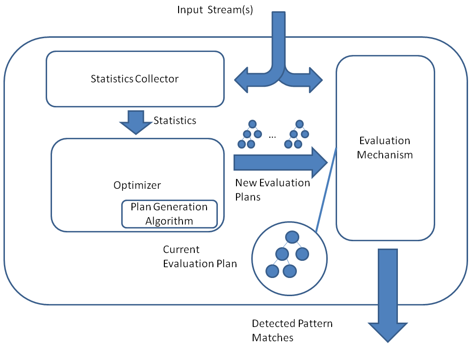

# OpenCEP
OpenCEP is an open-source library and framework providing advanced complex event processing (CEP) capabilities.

CEP is a prominent technology for robust and high-performance real-time detection of arbitrarily complex patterns in massive data streams. It is widely employed in many areas where extremely large amounts of streaming data are continuously generated and need to be promptly and efficiently analyzed on-the-fly. Online finance, network security monitoring, credit card fraud detection, sensor networks, traffic monitoring, healthcare industry, and IoT applications are among the many examples.

CEP systems treat data items as primitive events arriving from event sources. As new primitive events are observed, they are assembled into higher-level complex events matching the specified patterns. The process of complex event detection generally consists of collecting primitive events and combining them into potential (partial) matches using some type of detection model. As more events are added to a partial match, a full pattern match is eventually formed and reported.

The patterns detected by CEP engines are often of exceedingly high complexity and nesting level, and may include multiple complex operators and conditions on the data items. Moreover, these systems are typically required to operate under tight constraints on response time and detection precision, and to process multiple patterns and streams in parallel. Therefore, advanced algorithmic solutions and sophisticated optimizations must be utilized by CEP implementations to achieve an acceptable level of service quality.



The figure above presents an overview of OpenCEP structure. Incoming data streams are analyzed on-the-fly and useful statistics and data characteristics are extracted to facilitate the optimizer in applying the aforementioned optimization techniques and maximize the performance of the evaluation mechanism – a component in charge of the actual pattern matching.

By incorporating a multitude of state-of-the-art methods and algorithms for scalable event processing, OpenCEP can adequately satisfy the requirements of modern event-driven domains and outperform existing alternatives, both in terms of the actual performance and the provided functionality.

OpenCEP features a generic and intuitive API, making it easily applicable to any domain where event-based streaming data is present. 

# How to Use
* Users can apply complex patterns on event streams by creating and invoking a CEP object (CEP.py).
* The CEP object is initialized with a list of patterns to be detected and a set of configurable parameters.
* To create an event stream, you can manually create an empty stream and add events to it, and you can also provide a csv file to the fileInput function.
* To handle the CEP output, you can manually read the events from the CEP object or from the matches container, or use the fileOutput function to print the matches into a file.
* To create a pattern, the following components must be specified:
    * The pattern structure - e.g., SEQ(A, B, C) or AND(X, Y).
    * The condition that must be satisfied by the atomic items in the pattern structure.
    * The time window within which the atomic items in the pattern structure should appear in the stream.


# Usage Examples
## Defining a pattern
This pattern is looking for a short ascend in the Google peak prices:
```
# PATTERN SEQ(GoogleStockPriceUpdate a, GoogleStockPriceUpdate b, GoogleStockPriceUpdate c)
# WHERE a.PeakPrice < b.PeakPrice AND b.PeakPrice < c.PeakPrice
# WITHIN 3 minutes
googleAscendPattern = Pattern(
        SeqOperator(PrimitiveEventStructure("GOOG", "a"), 
                    PrimitiveEventStructure("GOOG", "b"), 
                    PrimitiveEventStructure("GOOG", "c")),
        AndCondition(
            SmallerThanCondition(Variable("a", lambda x: x["Peak Price"]), 
                                 Variable("b", lambda x: x["Peak Price"])),
            SmallerThanCondition(Variable("b", lambda x: x["Peak Price"]), 
                                 Variable("c", lambda x: x["Peak Price"]))
        ),
        timedelta(minutes=3)
    )
```
Another way to define the above example is to use SimpleCondition and a lambda function:
```
googleAscendPattern = Pattern(
        SeqOperator(PrimitiveEventStructure("GOOG", "a"), 
                    PrimitiveEventStructure("GOOG", "b"), 
                    PrimitiveEventStructure("GOOG", "c")),
        SimpleCondition(Variable("a", lambda x: x["Peak Price"]), 
                        Variable("b", lambda x: x["Peak Price"]),
                        Variable("c", lambda x: x["Peak Price"]),
                        lambda x,y,z: x < b < z),
        timedelta(minutes=3)
    )
```
This pattern is looking for low prices of Amazon and Google at the same minute:
```
# PATTERN AND(AmazonStockPriceUpdate a, GoogleStockPriceUpdate g)
# WHERE a.PeakPrice <= 73 AND g.PeakPrice <= 525
# WITHIN 1 minute
googleAmazonLowPattern = Pattern(
    AndOperator(PrimitiveEventStructure("AMZN", "a"), PrimitiveEventStructure("GOOG", "g")),
    AndCondition(
        SmallerThanEqCondition(Variable("a", lambda x: x["Peak Price"]), 73),
        SmallerThanEqCondition(Variable("g", lambda x: x["Peak Price"]), 525)
    ),
    timedelta(minutes=1)
)
```
Another way to define the above pattern is to use the generic BinaryCondition with a lambda function
```
googleAmazonLowPattern = Pattern(
    AndOperator(PrimitiveEventStructure("AMZN", "a"), PrimitiveEventStructure("GOOG", "g")),
    BinaryCondition(Variable("a", lambda x: x["Peak Price"]),
                    Variable("g", lambda x: x["Peak Price"]),
                    lambda x, y: x <= 73 and y <= 525),
    timedelta(minutes=1)
)

```
## Activating the CEP engine
Creating a CEP object for monitoring the first pattern from the example above:
```
cep = CEP([googleAscendPattern])
```

Defining a new file-based event stream formatted according to Metastock 7 format:
```
events = FileInputStream("test/EventFiles/NASDAQ_SHORT.txt")
```

Applying an existing CEP object on an event stream created above and storing the resulting pattern matches to a file:
```
cep.run(events, FileOutputStream('test/Matches', 'output.txt'), MetastockDataFormatter())
```

## Advanced features and settings
### Kleene Closure Operator 

The following is the example of a pattern containing a Kleene closure operator:

```
pattern = Pattern(
        SeqOperator(
            PrimitiveEventStructure("GOOG", "a"), 
            KleeneClosureOperator(PrimitiveEventStructure("GOOG", "b"))
        ),
        AndCondition(
            SmallerThanCondition(Variable("a", lambda x: x["Peak Price"]), Variable("b", lambda x: x["Peak Price"])),
            SmallerThanCondition(Variable("b", lambda x: x["Peak Price"]), Variable("c", lambda x: x["Peak Price"]))
        ),
        timedelta(minutes=5)
    )
```

The following example of a pattern containing a Kleene closure operator with an offset condition:
```
pattern = Pattern(
    SeqOperator(KleeneClosureOperator(PrimitiveEventStructure("GOOG", "a"))),
    AndCondition(
        SimpleCondition(Variable("a", lambda x: x["Opening Price"]), relation_op=lambda x: x > 0),
        KCValueCondition(names={'a'}, getattr_func=lambda x: x["Peak Price"],
                         relation_op=lambda x, y: x > y,
                         value=530.5),
        KCIndexCondition(names={'a'}, getattr_func=lambda x: x["Opening Price"],
                         relation_op=lambda x, y: x+0.5 < y,
                         offset=-1)
    ),
    timedelta(minutes=5)
)
```

The following example of a pattern containing a Kleene closure operator with a value condition:
```
pattern = Pattern(
    SeqOperator(KleeneClosureOperator(PrimitiveEventStructure("GOOG", "a"))),
    AndCondition(
        SimpleCondition(Variable("a", lambda x: x["Opening Price"]), 
                        relation_op=lambda x: x > 0),
        KCValueCondition(names={'a'}, 
                         getattr_func=lambda x: x["Peak Price"], 
                         relation_op=lambda x, y: x > y, value=530.5)
        ),
    timedelta(minutes=5)
)
```
### Negation Operator 

OpenCEP supports a variety of negation algorithms provided using the TreeBasedEvaluationMechanismParameters parameter.
It is an optional parameter, if the pattern includes negative events and negation algorithm was not provided, the naive negation algorithm would be used. 
 
The following is an example of a pattern containing a negation operator (without providing negation algorithm):

```
pattern = Pattern(
        SeqOperator(PrimitiveEventStructure("AAPL", "a"), 
                    NegationOperator(PrimitiveEventStructure("AMZN", "b")), 
                    PrimitiveEventStructure("GOOG", "c")),
        AndCondition(
            GreaterThanCondition(Variable("a", lambda x: x["Opening Price"]),
                                 Variable("b", lambda x: x["Opening Price"])),
            SmallerThanCondition(Variable("b", lambda x: x["Opening Price"]),
                                 Variable("c", lambda x: x["Opening Price"]))),
        timedelta(minutes=5)
    )

```
#### Optimizing evaluation performance with custom TreeBasedEvaluationMechanismParameters

The following is an example of a pattern containing a negation operator specifying the statistic negation algorithm:

```
pattern = Pattern(
        SeqOperator(PrimitiveEventStructure("AAPL", "a"), 
                    NegationOperator(PrimitiveEventStructure("AMZN", "b")), 
                    PrimitiveEventStructure("GOOG", "c")),
        AndCondition(
            GreaterThanCondition(Variable("a", lambda x: x["Opening Price"]),
                                 Variable("b", lambda x: x["Opening Price"])),
            SmallerThanCondition(Variable("b", lambda x: x["Opening Price"]),
                                 Variable("c", lambda x: x["Opening Price"]))),
        timedelta(minutes=5)
    )
    eval_params = TreeBasedEvaluationMechanismParameters(
        negation_algorithm_type = NegationAlgorithmTypes.STATISTIC_NEGATION_ALGORITHM
    )
    cep = CEP(pattern, eval_mechanism_params)
```
There is one more negation algorithm, the lowest position algorithm. In order to use it, use the TreeBasedEvaluationMechanismParameters as demonstrated above, specifying "NegationAlgorithmTypes.LOWEST_POSITION_NEGATION_ALGORITHM" as negation algorithm type.

The use of the non naive algorithms may improve system performance.
The statistic algorithm is recommended when data stream include a large amount of negative events.
The lowest position algorithm is recommended when some of the negative events are bounded (i.e. not located at the beginning nor the end of the events sequence in the pattern). 

### Consumption policies and selection strategies

OpenCEP supports a variety of consumption policies provided using the ConsumptionPolicy parameter in the pattern definition.

The following pattern definition limiting all primitive events to only appear in a single full match.
```
pattern = Pattern(
    SeqOperator(PrimitiveEventStructure("AAPL", "a"), 
                PrimitiveEventStructure("AMZN", "b"), 
                PrimitiveEventStructure("AVID", "c")), 
    TrueCondition(),
    timedelta(minutes=5),
    ConsumptionPolicy(primary_selection_strategy = SelectionStrategies.MATCH_SINGLE)
)
```
This selection strategy further limits the pattern detection process, only allowing to match produce a single intermediate partial match containing an event. 
```
pattern = Pattern(
    SeqOperator(PrimitiveEventStructure("AAPL", "a"), 
                PrimitiveEventStructure("AMZN", "b"), 
                PrimitiveEventStructure("AVID", "c")), 
    TrueCondition(),
    timedelta(minutes=5),
    ConsumptionPolicy(primary_selection_strategy = SelectionStrategies.MATCH_NEXT)
)
```
It is also possible to enforce either MATCH_NEXT or MATCH_SINGLE on a subset of event types. 
```
pattern = Pattern(
    SeqOperator(PrimitiveEventStructure("AAPL", "a"), 
                PrimitiveEventStructure("AMZN", "b"), 
                PrimitiveEventStructure("AVID", "c")), 
    TrueCondition(),
    timedelta(minutes=5),
    ConsumptionPolicy(single=["AMZN", "AVID"], 
                      secondary_selection_strategy = SelectionStrategies.MATCH_NEXT)
)
```
This consumption policy specifies a list of events that must be contiguous in the input stream, i.e., 
no other unrelated event is allowed to appear in between.
```
pattern = Pattern(
    SeqOperator(PrimitiveEventStructure("AAPL", "a"), 
                PrimitiveEventStructure("AMZN", "b"), 
                PrimitiveEventStructure("AVID", "c")), 
    TrueCondition(),
    timedelta(minutes=5),
    ConsumptionPolicy(contiguous=["a", "b", "c"])
)
```
The following example instructs the framework to prohibit creation of new partial matches
from the point a new "b" event is accepted and until it is either matched or expired.

```
# Enforce mechanism from the first event in the sequence
pattern = Pattern(
    SeqOperator(PrimitiveEventStructure("AAPL", "a"), 
                PrimitiveEventStructure("AMZN", "b"), 
                PrimitiveEventStructure("AVID", "c")), 
    AndCondition(
        GreaterThanCondition(Variable("a", lambda x: x["Opening Price"]), 
                             Variable("b", lambda x: x["Opening Price"])), 
        GreaterThanCondition(Variable("b", lambda x: x["Opening Price"]), 
                             Variable("c", lambda x: x["Opening Price"]))),
    timedelta(minutes=5),
    ConsumptionPolicy(freeze="b")
)
```

### Optimizing evaluation performance with custom TreeStorageParameters
```
storage_params = TreeStorageParameters(sort_storage=True,
                                       attributes_priorities={"a": 122, "b": 200, "c": 104, "m": 139})
eval_mechanism_params=TreeBasedEvaluationMechanismParameters(storage_params=storage_params)
cep = CEP(pattern, eval_mechanism_params)
```

### Probabilistic streams and confidence parameters

OpenCEP supports probabilistic streams, where each incoming event is associated
with an occurrence probability. In this scenario, a pattern should contain a
"confidence threshold" specifying what is the lowest acceptable probability of
a match of this pattern.

Probabilistic patterns are specified with the confidence threshold as follows:

```
pattern = Pattern(
        SeqOperator(
            PrimitiveEventStructure("GOOG", "a"), 
            PrimitiveEventStructure("GOOG", "b")
        ),
        SmallerThanCondition(Variable("a", lambda x: x["Peak Price"]), Variable("b", lambda x: x["Peak Price"])),
        timedelta(minutes=5),
        confidence=0.9
    )
```

## Twitter API support
### Authentication
To receive a Twitter stream via Twitter API, provide your credentials in plugin/twitter/TwitterCredentials.py
### Creating a twitter stream
To create a twitter stream, create an instance of TwitterInputStream and use it as you would any other OpenCEP input stream.
Filtering parameters for the twitter stream can be provided via the constructor of the class.
```
event_stream = TwitterInputStream(['corona'])
```
### Tweet formation in CEP
The format of a tweet is defined in Tweets.py (see documentation). The tweet keys are described there based on the overview of a tweet in https://developer.twitter.com/en/docs/tweets/data-dictionary/overview/tweet-object

